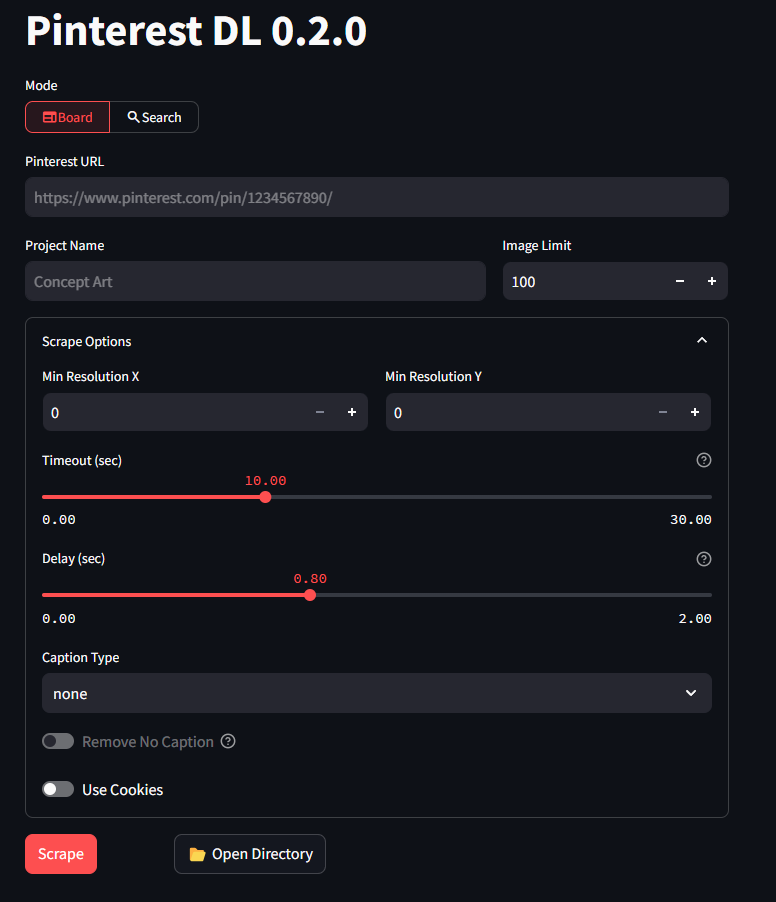

# Pinterest Downloader GUI


<a href="https://www.buymeacoffee.com/zekezhang" target="_blank"></a>

This is a web GUI for scraping Pinterest images with a given URL. It is built on top of the [pinterest-dl](https://github.com/sean1832/pinterest-dl) api, which is a Python package and command line tool for downloading Pinterest images.

> [!WARNING]
> This project is independent and not affiliated with Pinterest. It's designed solely for educational purposes. Please be aware that automating the scraping of websites might conflict with their [Terms of Service](https://developers.pinterest.com/terms/). The repository owner disclaims any liability for misuse of this tool. Use it responsibly and at your own legal risk.

## Features
- **HEIC Support**: Automatically handles HEIC/HEIF image formats
- **Port Configuration**: Runs on port 13100 by default
- **Docker Support**: Full Docker deployment support
- **File Filtering**: Automatically filters out unsupported image formats

## Installation
#### Automatic Installation
1. Clone the repository
```bash
git clone https//github.com/sean1832/pinterest-dl-gui.git
```
2. Execute `gui.bat` to start the server

#### Manual Installation
Some user might need to install manually.
1. Clone the repository
```bash
git clone https//github.com/sean1832/pinterest-dl-gui.git
```
2. Create a virtual environment and activate (optional but recommended)
```bash
python -m venv venv
./venv/Scripts/activate
```

3. Install the required packages
```bash
pip install -r requirements.txt
```

4. (Optional) Install HEIC support for better image format handling
```bash
./install_heic_support.sh
```

5. Start the server
```bash
streamlit run gui.py
```

> [!TIP]
> Subsequent runs after installation can be done by executing `gui.bat` even if you installed manually.

## HEIC Support
This application now includes support for HEIC/HEIF image formats. If you encounter errors with HEIC files:

1. **Automatic Solution**: The app will automatically filter out HEIC files if HEIC support is not available
2. **Full Support**: Run `./install_heic_support.sh` to install full HEIC support
3. **Docker**: HEIC support is included in the Docker image by default

## Docker Deployment
See [DOCKER_DEPLOY.md](DOCKER_DEPLOY.md) for detailed Docker deployment instructions.

## Graphical User Interface

